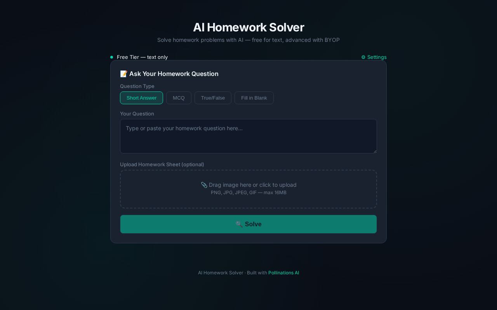
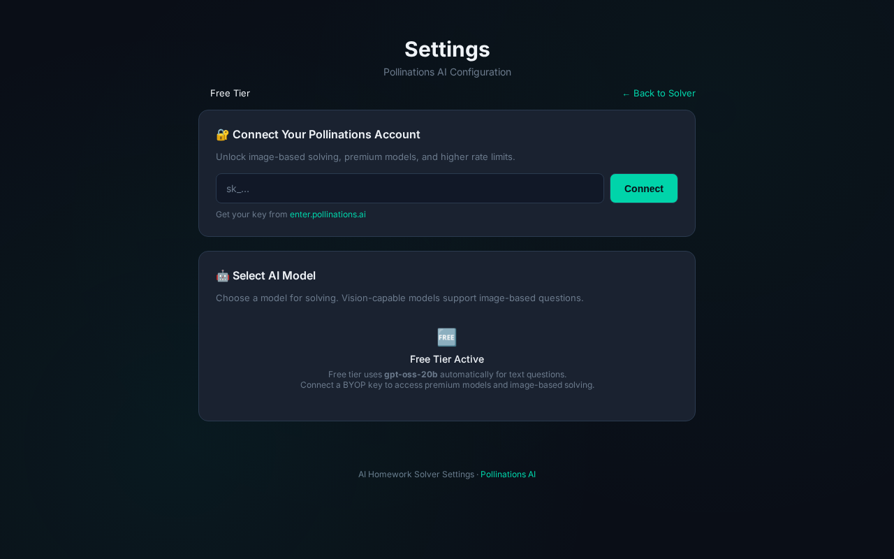
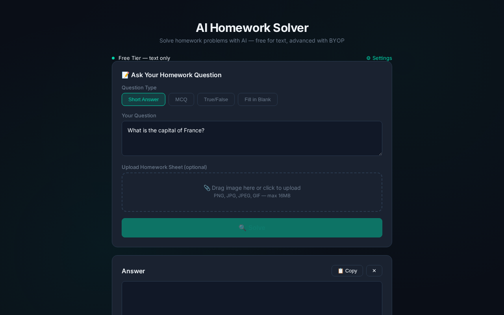

# AI Homework Solver

Solve homework problems with AI — **free for text** (anonymous tier), advanced features with **BYOP** (Bring Your Own Pollen) authentication.

**Live Demo:** https://ai-homework-solver.up.railway.app/

## Screenshots

### Main Solver Interface


### Settings Dashboard


### Demo: Solving a Question


## Quick Start (Local)

```bash
pip install -r requirements.txt
python app.py
# Open http://localhost:5000
```

## Features

- ✅ **Free tier**: Anonymous requests to `text.pollinations.ai/openai` (model: `gpt-oss-20b`)
- ✅ **BYOP tier**: Authenticated requests to `gen.pollinations.ai/v1/chat/completions`
- ✅ **Image upload**: Upload homework sheets for vision-capable models (requires BYOP key)
- ✅ **4 question types**: MCQ, short answer, true/false, fill in the blank
- ✅ **Settings dashboard**: Connect/disconnect BYOP key, view models, select active model
- ✅ **25% developer markup** on BYOP requests (your key must include the markup)

## API Endpoints

| Method | Path | Description |
|--------|------|-------------|
| `POST` | `/api/solve` | Solve a homework question (auto-selects free/BYOP) |
| `GET`  | `/api/models` | List available models |
| `POST` | `/api/select-model` | Set active model |
| `POST` | `/api/connect` | Connect BYOP key |
| `POST` | `/api/disconnect` | Disconnect BYOP key |
| `POST` | `/api/upload-image` | Upload image for vision models |

### `/api/solve`

```json
// Request
POST /api/solve
{
  "question": "What is the capital of France?",
  "question_type": "short_answer",
  "image_b64": "..."  // optional, base64 image
}

// Response
{
  "success": true,
  "solution": "Paris.",
  "tier": "Free",
  "used_byop": false
}
```

## Getting a BYOP Key

1. Go to [enter.pollinations.ai](https://enter.pollinations.ai)
2. Click **Authorize** (OAuth login)
3. Copy your `sk_…` key
4. Paste it in the **Settings** page → **Connect**

## Deployment

### Deploy to Railway (Free)

[](https://railway.app/new/template?templateDir=.&repo=https://github.com/zizoisu/ai-homework-solver)

Or manual deploy:

```bash
# 1. Fork this repository
# 2. Go to https://railway.app
# 3. Create a new project and link your GitHub repo
# 4. Set the following environment variable:
#    SECRET_KEY=some-random-secret-key
# 5. Deploy!
```

### Local Development

```bash
git clone https://github.com/zizoisu/ai-homework-solver.git
cd ai-homework-solver
pip install -r requirements.txt
python app.py
```

## Architecture

```
Free tier (no key):
  Browser → /api/solve → text.pollinations.ai/openai (no model param)
  
BYOP tier (with key):
  Browser → /api/solve → gen.pollinations.ai/v1/chat/completions
  Browser → /api/models → gen.pollinations.ai/v1/models
```

## License

MIT